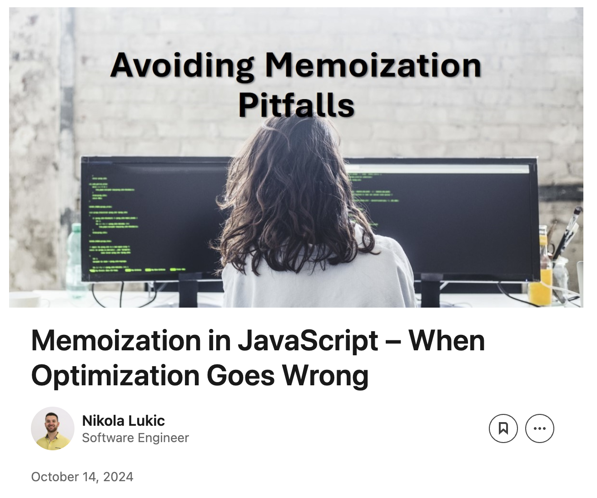

# Nikola Lukic
Full-Stack Software Engineer with 4+ years of experience specialising in React, Next.js, Vue.js, and Laravel, with additional expertise in blockchain development on EVM and Cardano based systems. Proven track record of leading development teams, delivering high-performance web applications, and mentoring developers.

Successfully completed multiple freelance projects and taught a web development university course at the SAE Institute in Belgrade.

Currently serving as a co-organizer for BelgradeJS events featuring guest speakers, contributing to the web development community through volunteer work.

<!-- Here's a project I'm very proud of - a [command line simulated in the browser](https://nlukic97.github.io) inspired by a windows console emulator I use (open the link on your Desktop browser for an additional perk 🙂). -->

---

## Tech stack

---
## My Open source contributions
Here are a few open source contributions I've made:

-  [fen-validator](https://www.npmjs.com/package/fen-validator) -  package used to validate the Chess FEN notation. I added type checking to the package to prevent accidental errors. Pull request [here](https://github.com/jayasurian123/fen-validator/pull/23).

-  [laravel-cookie-consent](https://github.com/whitecube/laravel-cookie-consent) - php package used to register, configure and ask for cookies consent in a EU-compliant way. I made updates to prevent `undefined variable` errors when submiting cookie consent preferences. Pull request [here](https://github.com/whitecube/laravel-cookie-consent/pull/89).

-  [freeCodeCamp](https://www.freecodecamp.org) learning platform. The mission of FreeCodeCamp: to help people learn to code for free. I clarified the directions for a practise task. Pull request [here](https://github.com/freeCodeCamp/freeCodeCamp/pull/53611).

---

## Organizer of JavaScript meetups
I organize regular JavaScript meetups as a co-organizer for BelgradeJS - an organization which contributes the JavaScript ecosystem by hosting meetups with guest speakers.

_myself (far right) at a meetup with my teammates._

 

_myself (standing in the middle) at a meetup with my teammates._

## Insights and articles

I share valuable web development insights through posts and articles on my [linked feed](https://www.linkedin.com/in/nikola-lukic):

 

